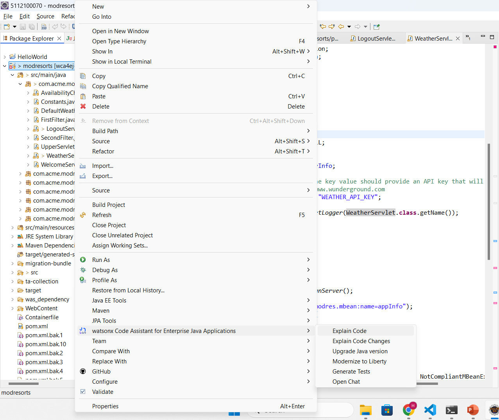
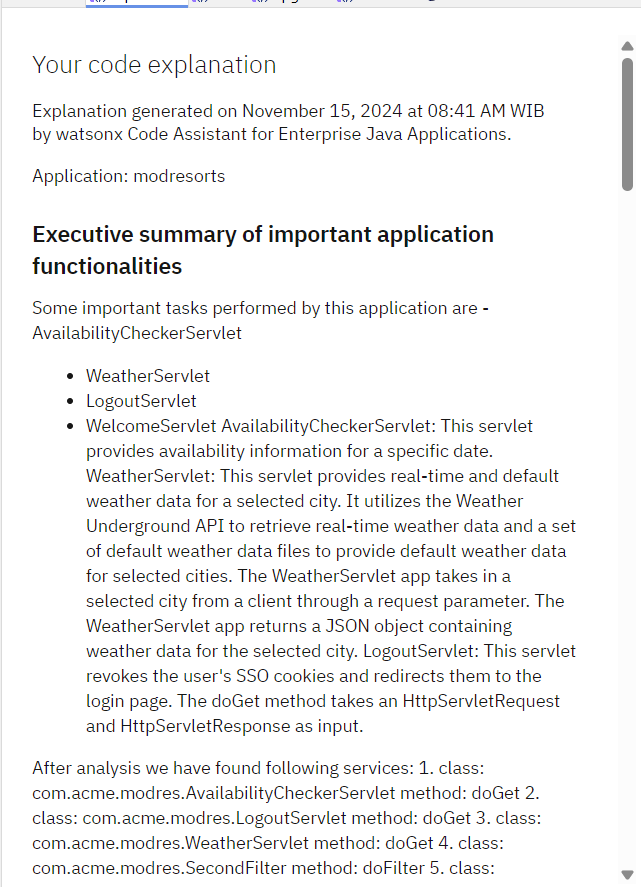
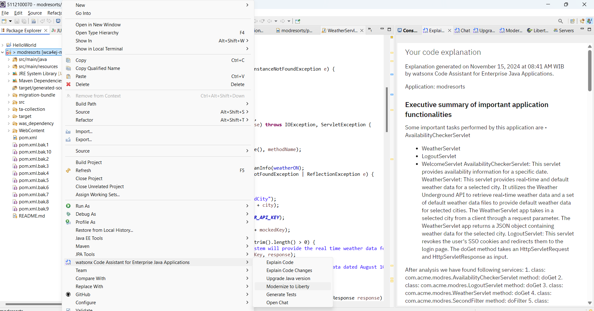
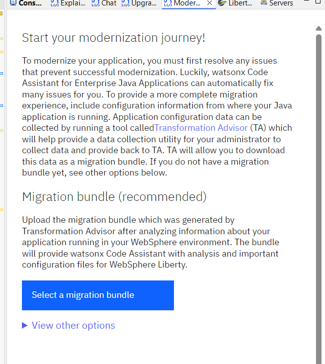
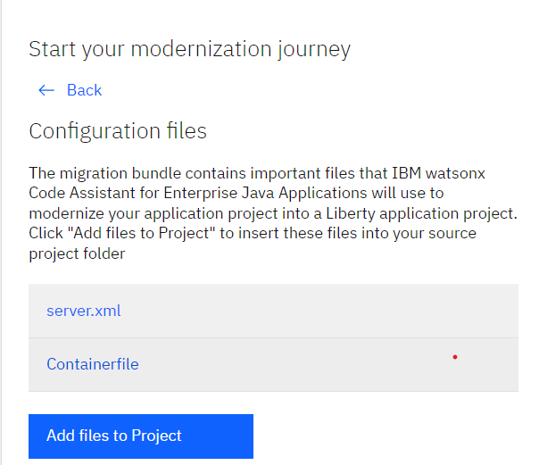
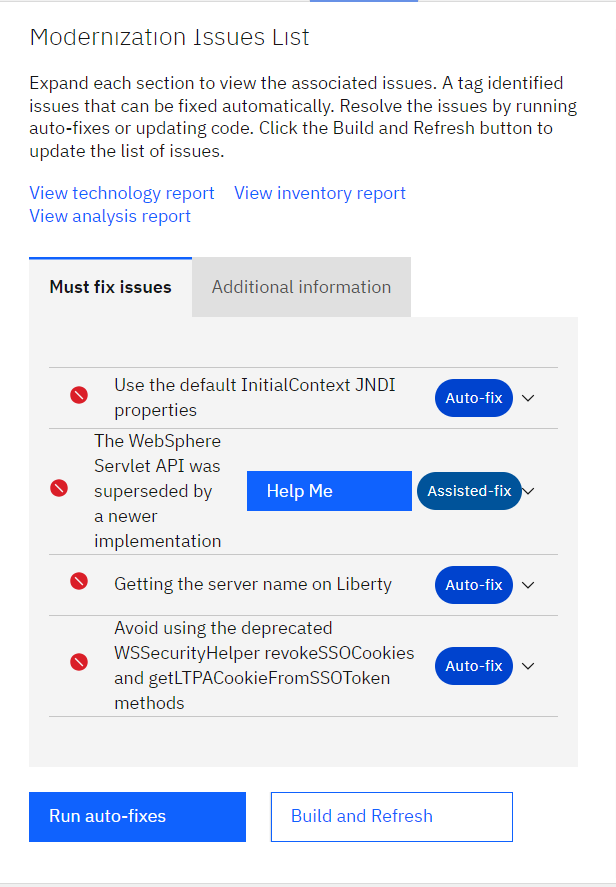

# Build Project
1. Open a terminal, and go to your project folder, and navigate to was_dependency
folder.

```bash
cd wca4ej-workshop/modresorts-twas-j8/was_dependency
```

2. Once inside the folder, run the following command to build project:

```bash
mvn install:install-file -Dfile=was_public.jar -DpomFile=was_public-9.0.0.pom
```

## USECASE 1: Explain Application

1. Import the project into Eclipse:

    - In the Package explorer, select Import projects, and select Maven
followed by selecting Existing Maven projects

    - Browse to the project which you cloned from the git:

```bash
path_to_cloned_repo/wca4ej-workshop/modresorts-twas-j8
• Click open and finish.
```


2. Once your IDE is setup, we will get an explanation of the entire project to understand what the app is doing: 

Right Click on `modresorts project -> select watsonx Code Assistant for
Enterprise Java Applications, then select Explain Code`



3. Once you click Explain Code, a new tab would open up and it will show the explanation of the entire application.
(Note: Getting explanation might take some time at the moment)



## USECASE 2: Modernize app runtime (traditional WebSphere to Liberty)
1. Right click on the project, select watsonx Code Assistant for Enterprise Java Applications, then select Modernize to Liberty:



2. After selecting modernize to liberty, following box should appear:


3. Click Select a migration bundle, and browse to your cloned project and select the file: `migration-bundle/modresorts.ear_migrationBundle.zip`

    - That migration bundle has been generated by Transformation Advisor as
a result of scanning the ModResorts application that was deployed to the traditional WebSphere Application Server environment. It contains configuration information for the application (the server.xml), and analysis that describes the issues that need to be addressed (the code changes that need to be made) in order for the application to run
successfully on Liberty.
    - The server.xml contains the configuration for the application. The Containerfile can be used to build a Liberty image of your application (outside the scope of this scenario)




4. Click the button to `Add files to Project`. You should see the following panel:


You will see 4 issues that must be fixed before the application can run successfully in Liberty. Three of the issues have auto fixes, and one issue has an assisted fix, using the watsonx Code Assistant.

6. At this point BEFORE we actually fix the issues, it is interesting to take a look at the ModResorts application. Because we have the server.xml in place, the application can be run on Liberty, although we will expect that at least some functionality is broken because we have not yet addressed the issues. 
• Launch ModResorts from the Liberty Dashboard:
• NOTE: If you don’t see modresorts in Liberty Dashboard. Click Build and Refresh under Modernize Project tab.