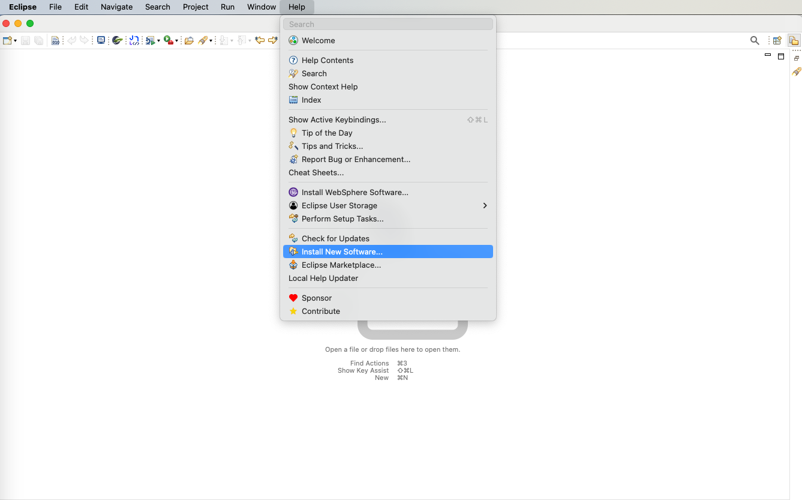
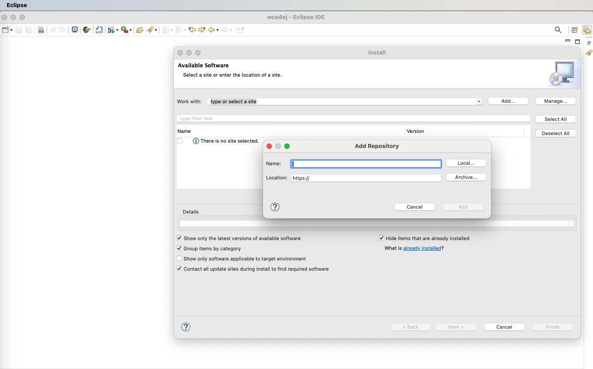
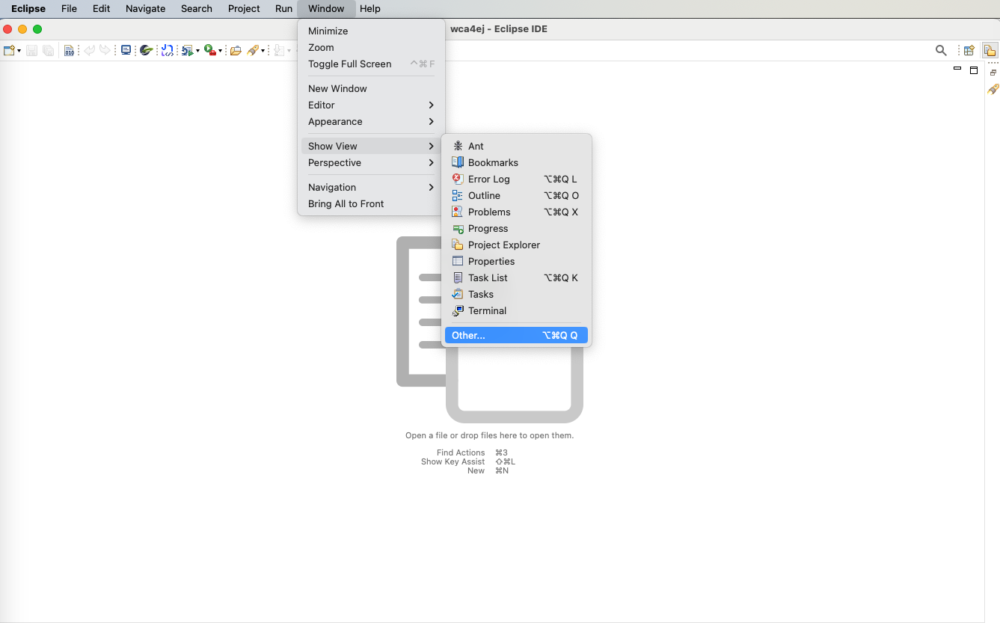
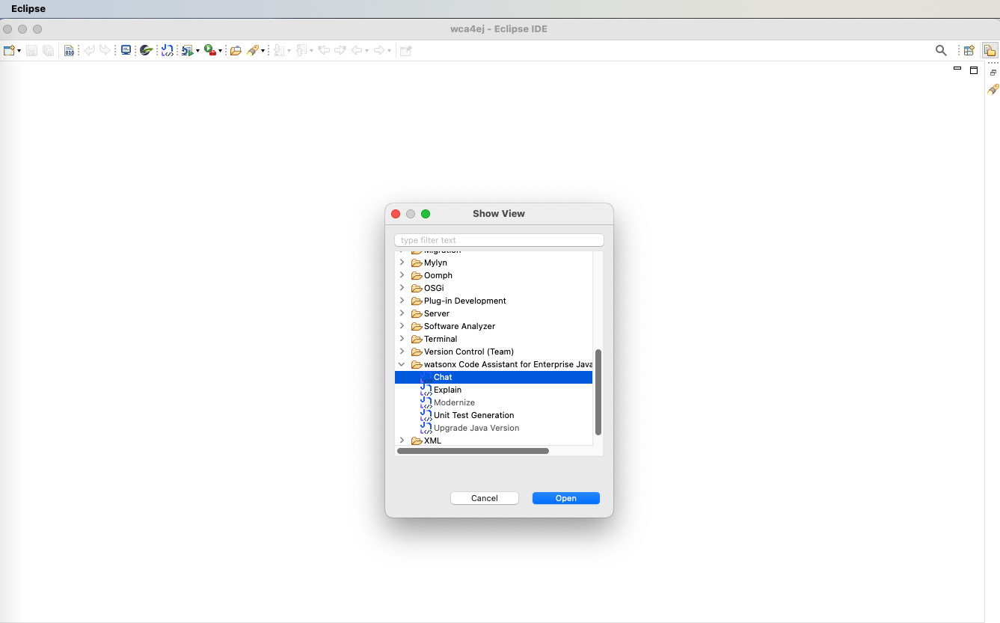
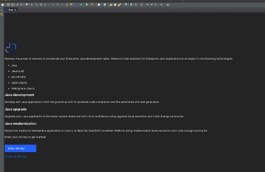
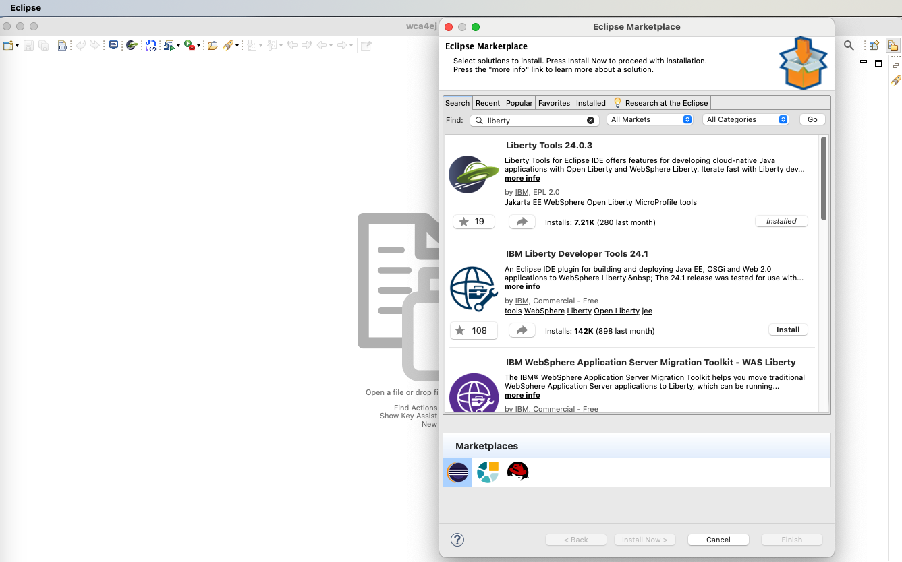

# Incubation Watsonx Code Assistant Java (WCA4EJ)

## Environment setup
### 1. Java installation
Install Java21 using this link [Download Java](https://www.oracle.com/sg/java/technologies/downloads/)
> Note: After installing java,add java to `PATH` variable and set `JAVA_HOME` envitonment variable

### 2. Install Maven
- Windows
    - Visit the official Maven website: [Maven Download Page](https://maven.apache.org/download.cgi)
    - Under "Files", click on the binary zip archive link (e.g., apache-maven-x.x.x-bin.zip). 
    - Extract the zip file to a location of your choice, e.g., C:\Program Files\Apache\maven.
    - Add Maven to PATH and Set MAVEN_HOME variable 
- Mac
   - Install maven using homebrew

### 3. Install Eclipse
Eclipse users must install one of these two packages:
   - Eclipse IDE for Java Developers
   - Eclipse IDE for Enterprise Java and Web Developers 

Below are the links for eclipse installation
- [Eclipse 2024-03](https://www.eclipse.org/downloads/packages/release/2024-03/r)
- [Eclipse 2023-12](https://www.eclipse.org/downloads/packages/release/2023-12/r)

## Install Watsonx Code For Java
1. Download plugin from this [link](https://img-router.sgp1.cdn.digitaloceanspaces.com/share/com.ibm.wca.java.site-windows-x86_64-0.1.0-SNAPSHOT.zip)

2. After downloding the extension install the wca4ej using eclipse as shown below 

3. Choose the local package or archive and provide the path where the extension files are downloaded. 

4. After the software (extension gets installed), restart your IDE. After restart, navigate to below setting.

5. Then choose the Watson code assistant for enterprise java as below.

6. After this, you will be navigated to below screen, input the API key.

7. Installing Liberty Tools
Install the liberty tools from eclipse market place as shown below [Help >> Eclipse Marketplace]
